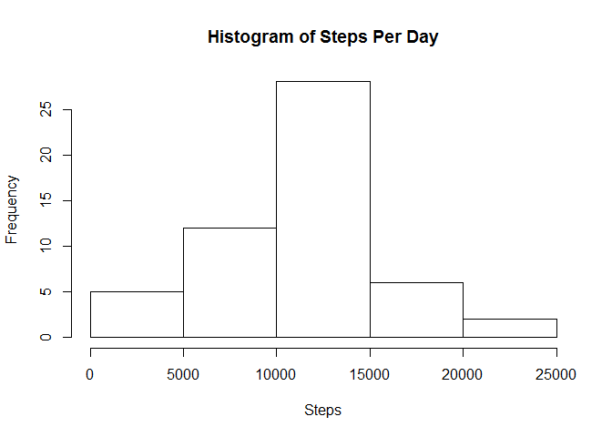
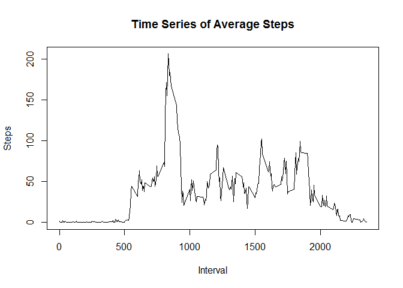
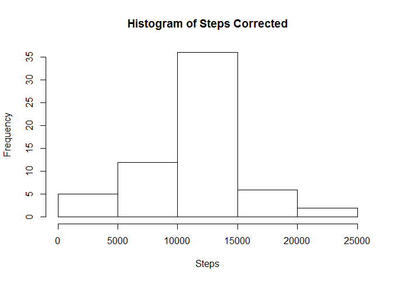
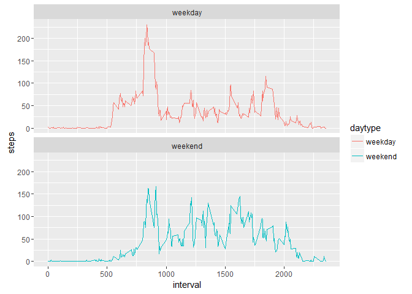

# Reproducible Research: Peer Assessment 1

## About
This is a project for Reproducible Research from Coursera's Data Science classes.

## Data
The data for this assignment can be downloaded from the course web site:

* Dataset: [Activity monitoring data](https://d396qusza40orc.cloudfront.net/repdata%2Fdata%2Factivity.zip) [52K]

The variables included in this dataset are:

* **steps**: Number of steps taking in a 5-minute interval (missing
    values are coded as `NA`)

* **date**: The date on which the measurement was taken in YYYY-MM-DD
    format

* **interval**: Identifier for the 5-minute interval in which
    measurement was taken

The dataset is stored in a comma-separated-value (CSV) file and there are a total of 17,568 observations in this dataset.

## Initial Setup
The following packages are required to run the below R code.

```r
require(ggplot2); require(lubridate); require(dplyr)
```

```
## Loading required package: ggplot2
```

```
## Loading required package: lubridate
```

```
## Loading required package: dplyr
```

```
## 
## Attaching package: 'dplyr'
```

```
## The following objects are masked from 'package:lubridate':
## 
##     intersect, setdiff, union
```

```
## The following objects are masked from 'package:stats':
## 
##     filter, lag
```

```
## The following objects are masked from 'package:base':
## 
##     intersect, setdiff, setequal, union
```

Set working directory to directory containing the data and script.

```r
# this.dir <- dirname(parent.frame(2)$ofile)
# setwd(this.dir)
```

## Loading and preprocessing the data
Load data and set date column to be a date vs a factor.

```r
activity <- read.csv(unz("activity.zip", "activity.csv"))
activity$date <- as.Date(activity$date)
```

## What is mean total number of steps taken per day?
Find mean steps taken per day.

```r
steps_per_date <- aggregate(steps~date, activity, sum)
steps_per_date_histogram <-
  hist(steps_per_date$steps, main="Histogram of Steps Per Day",
       xlab="Steps", ylab="Frequency")
```



```r
steps_per_date_mean <- mean(steps_per_date$steps)
paste("Mean steps per day:", steps_per_date_mean)
```

```
## [1] "Mean steps per day: 10766.1886792453"
```

```r
steps_per_date_median <- median(steps_per_date$steps)
paste("Median steps per day:", steps_per_date_median)
```

```
## [1] "Median steps per day: 10765"
```

The `mean` is 1.0766189\times 10^{4} and the `median` is 10765.

## What is the average daily activity pattern?
Calculate the average steps per interval for activity dataset.

```r
steps_per_interval <- aggregate(steps~interval, activity, mean)
```
Time series plot of average number of steps per interval.

```r
steps_per_interval_ts <-
  plot(x=steps_per_interval$interval, y=steps_per_interval$steps, type="l",
       main="Time Series of Average Steps", xlab="Interval", ylab="Steps")
```



Most steps get taken around 8:35am.

```r
interval_with_max_mean_steps <- 
  steps_per_interval[steps_per_interval$steps == max(steps_per_interval$steps),]$interval
interval_with_max_mean_steps
```

```
## [1] 835
```

## Imputing missing values
Calculate and report the total number of missing values in the dataset (i.e. the total number of rows with `NA`s)

```r
number_of_rows_with_na <- sum(is.na(activity$steps))
paste("Total number of missing values:", number_of_rows_with_na)
```

```
## [1] "Total number of missing values: 2304"
```
The total numer of missing values is 2304.

Calculating mean steps for each interval.

```r
activity_na_corrected <- activity
all_na <- is.na(activity_na_corrected$steps)
acivity_avg <- tapply(activity_na_corrected$steps, activity_na_corrected$interval, mean, na.rm=TRUE)
activity_na_corrected$steps[all_na] <- acivity_avg[as.character(activity_na_corrected$interval[all_na])]
```
Create data frame with na values replaced with interval averages.

```r
steps_per_date_corrected <- aggregate(steps~date, activity_na_corrected, sum)
```
Histogram of steps per day.

```r
steps_per_date_histogram_corrected <-
  hist(steps_per_date_corrected$steps, main="Histogram of Steps Corrected",
       xlab="Steps", ylab="Frequency")
```



Very little difference in the overall mean and median of steps per date for initial activity vs activity with na replaced with mean values per interval.

```r
steps_per_date_mean_corrected <- mean(steps_per_date_corrected$steps)
steps_per_date_median_corrected <- median(steps_per_date_corrected$steps)
paste("Mean steps per day:", steps_per_date_mean_corrected)
```

```
## [1] "Mean steps per day: 10766.1886792453"
```

```r
paste("Median steps per day:", steps_per_date_median_corrected)
```

```
## [1] "Median steps per day: 10766.1886792453"
```

## Are there differences in activity patterns between weekdays and weekends?
For loop to add column variable for weekend vs weekday.

```r
for (i in 1:nrow(activity_na_corrected)) {
  if (weekdays(activity_na_corrected$date[i]) == "Saturday" |
      weekdays(activity_na_corrected$date[i]) == "Sunday") {
    activity_na_corrected$daytype[i] = "weekend"
  } else {
    activity_na_corrected$daytype[i] = "weekday"
  }
}
```
Time series weekend vs weekday. More activity takes place in the morning on weekdays vs weekends, and more activity takes place throughout the day on weekends vs weekdays.

```r
activity_no_na <- activity_na_corrected %>%
  group_by(interval, daytype) %>%
  summarize(steps = mean(steps))
panelplot <- ggplot(activity_no_na, aes(x=interval, y=steps, color = daytype)) +
  geom_line() +
  facet_wrap(~daytype, ncol = 1, nrow=2)
panelplot
```



